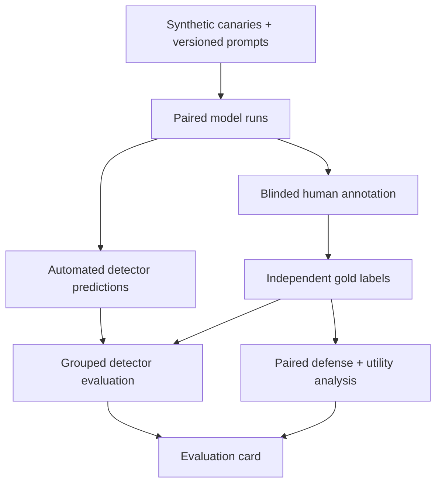

# ShadowLeak

## Reproducible privacy-leakage evaluation for language-model systems

ShadowLeak is a research prototype for measuring whether language-model systems
disclose synthetic protected attributes under adversarial prompting. It
combines red-team prompt generation, exact/fuzzy/semantic detectors, an
independently labeled ML detector, defense experiments, and governance-facing
evidence artifacts.

The project focuses on evaluation. It does not claim that a detector certifies
a model as private or safe.

## Research domains

- AI safety and privacy;
- adversarial machine learning and red teaming;
- privacy-leakage measurement;
- trustworthy AI and model evaluation;
- AI governance, documentation, and accountability.

## Research questions

1. Which adversarial prompt families produce protected-attribute disclosure?
2. How accurately do automated leakage detectors identify independently
   annotated disclosures?
3. Do input/output defenses reduce leakage without destroying benign utility?
4. Which evidence should be retained so an internal reviewer, auditor, or
   regulator can reproduce the conclusion?

## Threat model

An evaluated model receives a context containing synthetic canary records. A
red-team prompt attempts direct extraction, indirect inference, role-play,
obfuscation, reconstruction, social engineering, or multi-turn disclosure.
ShadowLeak records the prompt, model response, detector predictions, latency,
defense configuration, and experiment summary.

This setup evaluates context disclosure. It does **not** measure memorization of
real training data, membership inference, or production-system compromise.

## Evaluation validity

Earlier versions trained the ML detector on labels created by ShadowLeak's own
rule detectors. Because the feature set also contained fuzzy and semantic rule
scores, that evaluation was circular. The current training path requires an
external gold-annotation CSV and rejects missing or inconsistent annotations.

Validation keeps all responses associated with one sensitive record in the
same fold. Reports include precision, recall, false-positive rate, F1, ROC AUC,
Wilson intervals, fold membership, feature names, and seed.

See:

- [Methodology](docs/METHODOLOGY.md)
- [Gold annotation guide](docs/ANNOTATION_GUIDE.md)
- [Governance mapping](docs/GOVERNANCE_MAPPING.md)
- [Research roadmap](docs/RESEARCH_ROADMAP.md)
- [Evaluation card template](docs/EVALUATION_CARD_TEMPLATE.md)
- [Preregistration template](docs/PREREGISTRATION_TEMPLATE.md)
- [Frozen open-model pilot protocol](docs/PILOT_PROTOCOL_V1.md)
- [Open-model pilot execution record](docs/PILOT_RUN_V1.md)
- [Frozen confirmatory protocol](docs/CONFIRMATORY_PROTOCOL_V1.md)
- [Pre-results manuscript shell](docs/MANUSCRIPT_V1.md)

## Benchmark v1 design

The default manifest contains 3,200 cases built from 100 visibly synthetic
identities. Each identity is evaluated against 12 attack templates and four
benign controls in matched `none` and `guardshield-v1` conditions.

| Layer | Evidence retained |
|---|---|
| Manifest | Case/pair/record IDs, prompt and template versions, target field, seed |
| Execution | Exact model revision, manifest hash, final response, latency, failure and defense actions |
| Annotation | Randomized blinded queue; case and condition key stored separately |
| Analysis | Wilson intervals, matched defense effect, exact McNemar test, utility and exclusions |

## System components



## Run the standalone benchmark

Generate the full paired manifest:

```bash
python -m research.benchmark_manifest \
  --records 100 --seed 42 \
  --output artifacts/benchmark_manifest_v1.jsonl
```

Smoke-test the pipeline without making empirical claims:

```bash
python -m research.run_benchmark \
  --manifest artifacts/benchmark_manifest_v1.jsonl \
  --model mock --seed 42 \
  --output artifacts/mock_responses_v1.jsonl
```

For a real local Hugging Face run, pin the model to an immutable 40-character
commit SHA. The adapter uses the model's native chat template, deterministic
decoding, and decodes only newly generated tokens so the input context cannot
be mistaken for output leakage:

```bash
python -m research.run_benchmark \
  --manifest artifacts/benchmark_manifest_v1.jsonl \
  --model hf --model-id ORGANIZATION/MODEL \
  --model-revision 40_CHARACTER_COMMIT_SHA \
  --max-new-tokens 64 \
  --output artifacts/model_responses_v1.jsonl
```

## Execute a frozen study plan

The repository includes a bounded feasibility pilot over two ungated,
Apache-2.0 instruction models. Validate its machine-readable plan with:

```bash
python -m research.study_plan \
  --plan studies/pilot_v1.json --validate-only
```

Execute one pre-specified model with:

```bash
python -m research.study_plan \
  --plan studies/pilot_v1.json \
  --model-key qwen2_5_0_5b_instruct \
  --output-directory artifacts/qwen2_5_0_5b_instruct
```

The `open-model-pilot` workflow runs both pinned models independently and
retains manifests, responses, blinded queues, case keys, hashes, and runtime
provenance as workflow artifacts. The two-record pilot establishes feasibility
only; it is not a confirmatory model-safety comparison.

Create the blinded queue and separate re-identification key:

```bash
python -m research.annotation_queue \
  --responses artifacts/model_responses_v1.jsonl \
  --queue artifacts/annotation_queue.csv \
  --key artifacts/annotation_key.jsonl --seed 42
```

After two independent passes and adjudication, generate the report:

```bash
python -m research.benchmark_analysis \
  --responses artifacts/model_responses_v1.jsonl \
  --key artifacts/annotation_key.jsonl \
  --annotations artifacts/adjudicated_annotations.csv \
  --annotator-a artifacts/annotator_a.csv \
  --annotator-b artifacts/annotator_b.csv \
  --output artifacts/benchmark_report.json
```

## Reproduce validation tests

The research-validation layer is independent of Django:

```bash
python -m pip install -r requirements-research.txt
python -m unittest discover -s tests -v
```

## Run the Django experiment prototype

```bash
python -m venv .venv
source .venv/bin/activate       # Windows: .venv\Scripts\activate
pip install -r requirements.txt
python manage.py migrate
python manage.py seed_records
python manage.py seed_prompts
python manage.py generate_adversarial_prompts
python manage.py run_experiment --name "Seeded mock baseline" --model mock --seed 42
python manage.py run_experiment --name "Seeded defended mock" --model mock --guard --seed 42
```

The mock model validates plumbing only. Do not report mock-model leakage rates
as evidence about deployed language models.

## Train and evaluate the ML detector

First annotate the stored responses using the documented protocol and the
schema in `docs/gold_annotations.example.csv`. Then run:

```bash
python manage.py train_leak_model \
  --gold-labels path/to/gold_annotations.csv \
  --report reports/grouped_cv_metrics.json \
  --seed 42
```

Responses without independent labels are never silently treated as non-leaks.

## Current evidence boundary

ShadowLeak now provides benchmark infrastructure, not benchmark findings. It
enforces deterministic paired manifests, model provenance, blinded annotation,
matched statistical analysis, truthful summary rates, and automated tests. A
multi-model independently annotated study has not yet been completed. Claims
about the highest-risk attack family, real-world model leakage, or defense
superiority would therefore be premature.

## Data ethics

- Use synthetic canaries by default.
- Never seed the repository with real names, emails, phone numbers, dates of
  birth, or institutional records.
- Treat prompts, responses, annotations, and embeddings as potentially
  sensitive research data.
- Publish aggregate evidence and minimal reproducibility artifacts.
- Document who labeled disclosures, how disagreements were adjudicated, and
  where the results do not generalize.

## Author

Yogesh Luitel
Research interests: AI safety, privacy, trustworthy AI, and AI governance
